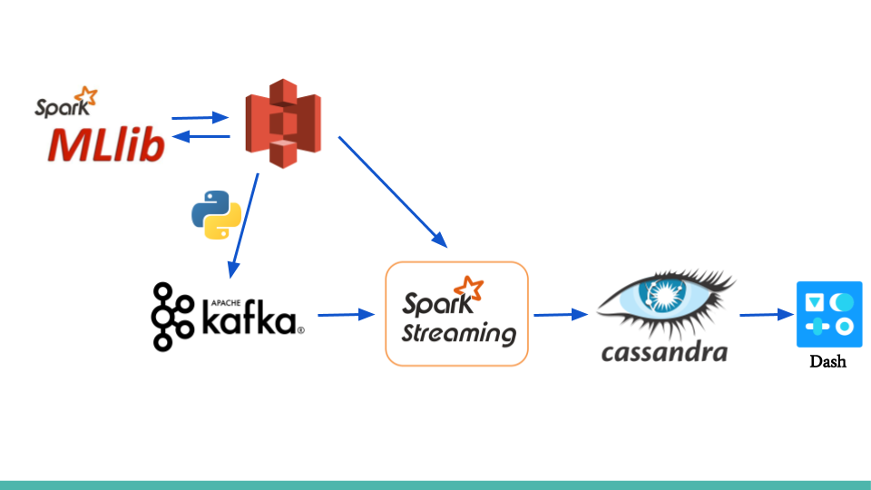

# Server Safe
My Insight Data Engineering project for the NY Winter 2019 session. "Server Safe" is an application that uses a data pipeline to monitor web server traffic and predict potential attacks in real time.

A website of the application can be found [here](http://nysees.xyz)

# Motivation
In the online world, it is important to monitor server health and traffic to be alert of potential attacks from other users. The most famous attack is the DoS (Denial of Service) attack where a single IP or multiple IPs flush the web server with requests thereby paralyzing the service. Other harmful activities include SQL injection or bots. Therefore, it is necessary to have an automated an accurate system to monitor live traffic through web servers and alert engineers or admins of the potential risks

# Pipeline

"Server Safe" runs a pipeline on the AWS cloud, using the following cluster configurations:

* four m4.large EC2 instances for Kafka
* four m4.large EC2 instances for the Spark Streaming job
* One m4.large EC2 instances for the Spark batch job
* Two m4.large EC2 instances to run Cassandra DB and the Dash front-end application

Using Kafka to ingest traffic stream simulated from a file on S3, Spark Streaming to predicted potential attacks in 5 second intervals using a pre-trained model by Spark batch job and Cassandra to store the processed data to be queried, the data is then rendered in Dash to show real-time updates to server traffic or attack predictions every second.

To replicate my pipeline follow the following steps:

1. Install zookeeper v3.4.13 and kafka v 1.10 on kafka Cluster and start zookeeper and kafka
2. Install Hadoop v2.7.6 and Spark v2.3.1 on spark Cluster and start spark
3. Install Cassandra v3.11.2 on Cassandra Cluster and start cassandra server
4. Install Dash, Dash-core-components, and Dash-html-components python packages on Dash node

* copy spark_MLlib/spark_ml.py and spark_streaming_prediction/streaming_processing.py, submit.sh to spark master node
* copy kafka/kafka.sh, producer.py to kafka cluster master node
* copy Cassandra/Create_tables.py to cassandra master node (or node 1)
* copy Dash/tables.py to dash node
* copy tools/utility.py to spark, kafka, and cassandra master nodes
---
* First run Create_tables.py on cassandra master node to create 3 tables
* Run spark_ml.py on spark cluster to train and save the randomforest model first
* Start tables.py (front end app) using gunicorn according to this link: [here](https://github.com/OXPHOS/GeneMiner/wiki/Setup-front-end-with-plotly-dash,-flask,-gunicorn-and-nginx)
* Once the model is saved and ui app started, start kafka producer by running producer.py on kafka master node
* Start spark job by running submit.sh on spark master node
* Now the ui will update from cassandra tables every second
